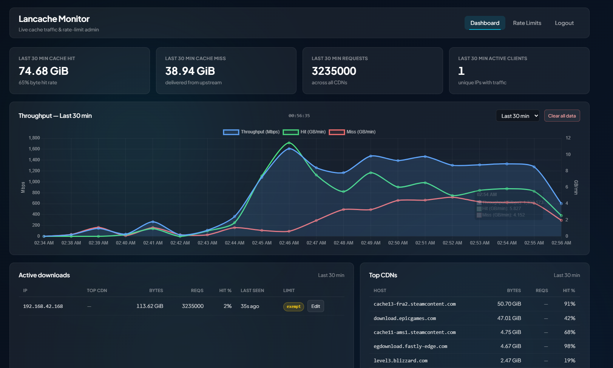
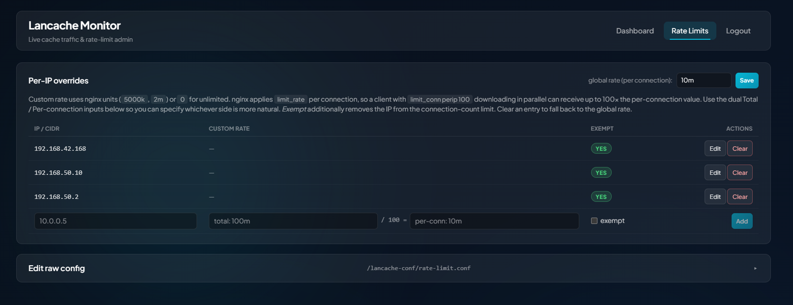

# Lancache Monitor

A sidecar container for [lancache-monolithic](https://github.com/lancachenet/monolithic).
Watches the access log, shows live hit/miss + per-IP throughput, and lets you
edit and reload `rate-limit.conf` from a browser.

```
┌──────────────────────────┐          ┌────────────────────────────┐
│ lancache (existing)      │          │ lancache-monitor (this)    │
│  nginx                   │          │  - tails access.log        │
│  /data/logs/access.log   │◀──RO───▶│  - SQLite per-minute stats │
│  /etc/nginx/conf.d/      │          │  - Datastar SSE dashboard  │
│    rate-limit.conf       │◀──RW───▶│  - reads/writes config     │
└──────────────────────────┘          │  - exec nginx -s reload    │
        ▲                             └────────────┬───────────────┘
        └──── docker exec nginx -s reload ─────────┘
              (via /var/run/docker.sock)
```

## Screenshots





## What you get

- **Live dashboard** — throughput chart, hit/miss ratio, per-CDN breakdown, and
  a table of every client IP currently downloading. Range is selectable from
  **last 5 min** through **all time** (5m / 10m / 30m / 1h / 12h / 24h / 7d / all)
  and persisted per-browser. The stat cards retotal to match the selected range,
  including the **active clients** count. A "Clear all data" button wipes the
  SQLite history when you want a clean slate.
- **Per-IP rate-limit overrides** — give a specific IP or CIDR its own
  `limit_rate`, mark it **exempt** from the per-IP connection limit, or both.
  The UI takes either total bandwidth or per-connection value (divides by
  `limit_conn perip`) so you can specify whichever side is more natural.
  First-time setup migrates your existing `rate-limit.conf` to a managed block
  in one click; the rest of the file stays editable.
- **Raw rate-limit editor** — direct textarea over `rate-limit.conf` for
  anything the override UI doesn't cover. Saving from either UI runs
  `nginx -t && nginx -s reload` inside the lancache container; if `nginx -t`
  fails, the previous file is restored automatically.
- **Single-password auth** — set `LCM_PASSWORD` and the dashboard requires login.
- **No external dependencies** — pure-Go SQLite, single 15 MB distroless image.

## Quick start — Windows native (.exe alongside Docker Desktop)

If your lancache runs in Docker Desktop and you'd rather just double-click an
exe than build another container, this works fine. The binary talks to the
Docker daemon over the npipe (`\\.\pipe\docker_engine`) and reads/writes the
host paths that Docker Desktop bind-mounts into the lancache container.

1. Build the exe:
   ```powershell
   go build -o lancache-monitor.exe .
   ```
2. Create a `.env` next to the exe. Example for a typical Windows setup where
   lancache lives at `C:\lancache\`:
   ```ini
   LCM_PASSWORD=change-me
   LCM_LANCACHE_CONTAINER=lancache
   LCM_LOG_PATH=C:/lancache/logs/access.log
   LCM_RATELIMIT_PATH=C:/lancache/custom/rate-limit.conf
   LCM_DB_PATH=monitor.db
   LCM_DOCKER_HOST=npipe:////./pipe/docker_engine
   ```
   `LCM_DOCKER_HOST` is auto-detected on Windows so this line is optional, but
   leaving it explicit makes failures easier to diagnose. `LCM_DB_PATH` defaults
   to `monitor.db` next to the exe.
3. Run it:
   ```powershell
   .\lancache-monitor.exe
   ```
   Open `http://localhost:8080` and log in. Stop with Ctrl+C.

If you want it to start with Windows: easiest is to drop a shortcut into
`shell:startup`, or wrap it as a service with [NSSM](https://nssm.cc/). The
exe is fully self-contained — templates, CSS, themes are all embedded.

## Quick start — Docker

A prebuilt image is published at
[`mchauge/lancache-monitoring`](https://hub.docker.com/r/mchauge/lancache-monitoring)
on Docker Hub, so you don't need a Go toolchain to run this — just pull the
image. (Building locally still works; see step 4.)

1. Copy and edit the example compose file:
   ```bash
   cp docker-compose.example.yml docker-compose.yml
   $EDITOR docker-compose.yml   # change LCM_PASSWORD, paths if not /opt/lancache
   ```
2. To use the published image, replace `build: .` in the compose file with:
   ```yaml
   image: mchauge/lancache-monitoring:latest
   ```
3. **Drop `:ro` on your existing lancache rate-limit mount** so the monitor can
   write to it:
   ```yaml
   # before
   - /opt/lancache/custom/rate-limit.conf:/etc/nginx/conf.d/rate-limit.conf:ro
   # after
   - /opt/lancache/custom/rate-limit.conf:/etc/nginx/conf.d/rate-limit.conf
   ```
4. Make sure the host file is readable+writable by the container UID. The
   distroless image runs as UID 65532; either chown the file or override with
   `user: "0:0"` on the service.
5. Bring it up:
   ```bash
   docker compose up -d        # uses mchauge/lancache-monitoring:latest
   # or, if you kept `build: .`:
   docker compose up -d --build
   ```
6. Open `http://<host>:8088`, log in, and watch traffic flow.

To upgrade later, pull the newest tag:

```bash
docker compose pull && docker compose up -d
```

## Configuration

Every option is an env var; see [.env.example](.env.example) and [CLAUDE.md](CLAUDE.md#environment-variables).

## How the cross-container reload works

The monitor mounts `/var/run/docker.sock` and uses the Docker API to run
`sh -c "nginx -t && nginx -s reload"` inside the lancache container. Output is
captured and surfaced in the UI. If the test fails (non-zero exit), the
monitor restores the previous `rate-limit.conf` before reporting back, so a
typo can never leave nginx running with a broken config.

This requires the lancache container to be running on the same Docker daemon
as the monitor. If you run them on different hosts, set `LCM_DOCKER_HOST` to
a TCP endpoint that exposes the lancache host's daemon (TLS strongly
recommended).

## Verification

After deploying:

1. Trigger a download (Steam game install, Epic update, etc.) and confirm:
   - the throughput line chart climbs;
   - the client IP appears in the **Active downloads** table;
   - the byte hit ratio updates as the cache warms;
   - switching the range dropdown (5m / 1h / 24h / all) re-totals the stat
     cards and reloads the chart.
2. On the **Rate Limits** page, add a per-IP override (e.g. `10.0.0.5`,
   total `100m`) and **Save**. Confirm the row appears in the table and that
   `cat /opt/lancache/custom/rate-limit.conf` shows the IP inside the managed
   `geo $lcm_rate_override { ... }` block. Clear the row and verify it falls
   back to the global rate.
3. Make a trivial edit in the raw editor (e.g. add a comment) and click
   **Apply & reload**. The output panel should show
   `nginx: configuration file ... test is successful` and
   `signal process started`.
4. Introduce a deliberate syntax error (`limit_rate WHATEVER;`) and click
   **Apply & reload**. The UI should report `nginx -t` failure and the file
   should be rolled back — verify with `cat /opt/lancache/custom/rate-limit.conf`.
5. Restart the monitor (`docker compose restart lancache-monitor`) and confirm
   the dashboard reloads with the chart still populated from SQLite.
6. Click **Clear all data** on the dashboard, confirm in the modal, and verify
   the chart and stat cards reset to zero (new traffic should still flow in).
7. Rotate the access log (`mv access.log access.log.1 && touch access.log`) and
   confirm the tailer picks up the new file within a few seconds.

## Tests

```bash
go test ./...
```

Covers the log parser, the SQLite aggregator, and the rate-limit file
read/write+restore path. Docker reload is integration-tested manually against
a real lancache.

## License

MIT — see [LICENSE](LICENSE).
